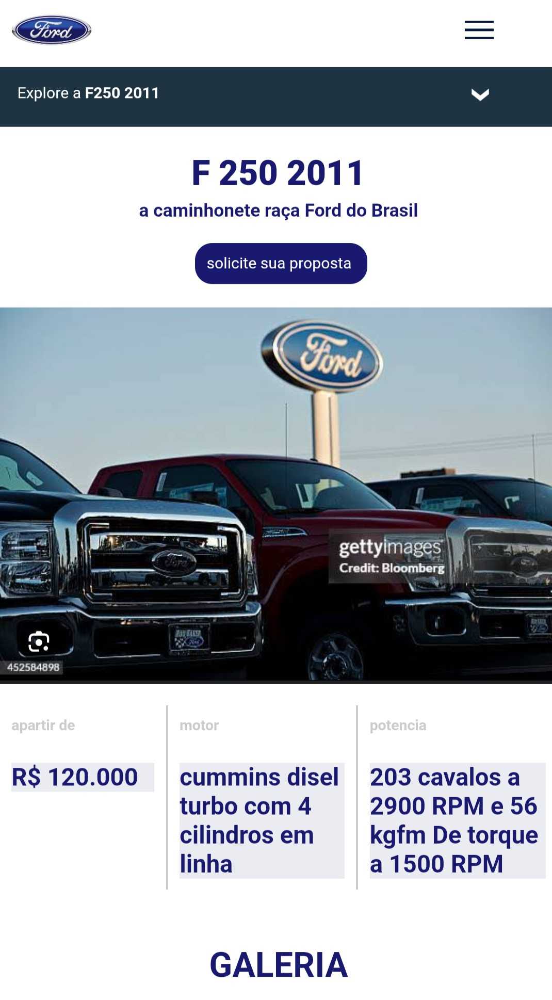
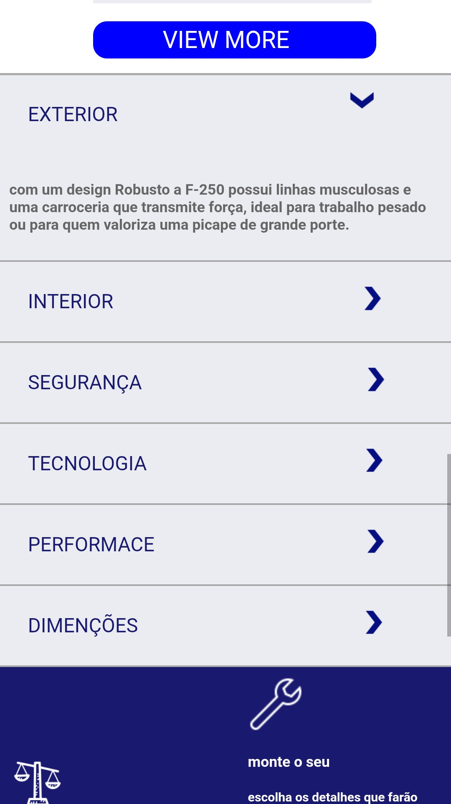
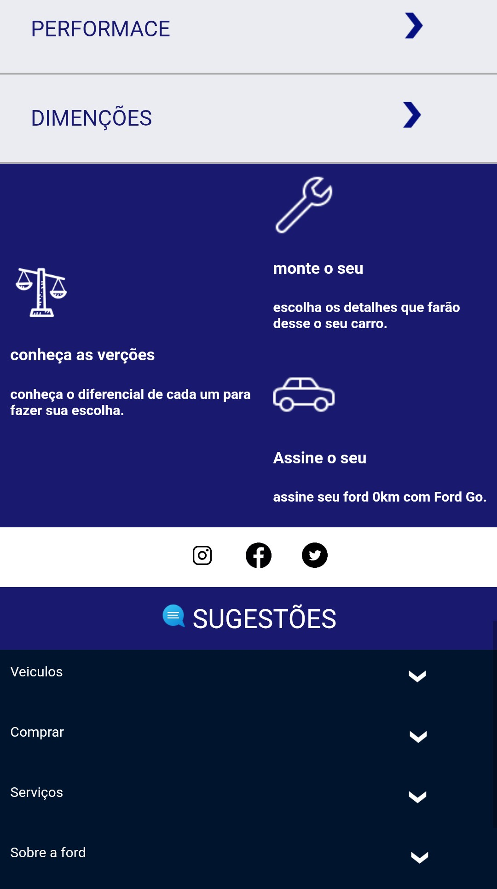
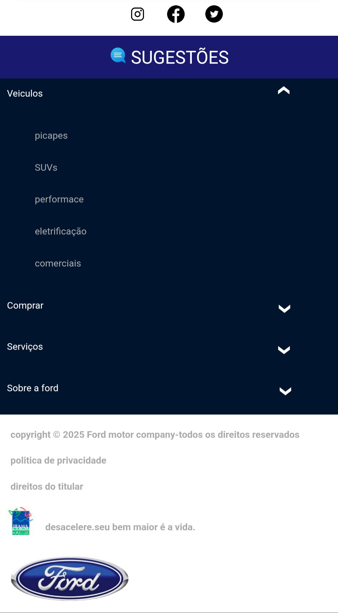

# ProjectFord_portifolio – Releitura Automotiva (Front-End)

Projeto autoral desenvolvido como estudo prático de **HTML, CSS e JavaScript**, inspirado em sites do setor automotivo.

O foco principal do projeto foi a **estruturação de layouts reais**, organização de código e experiência do usuário, priorizando o conceito **mobile-first**.

---

## 🎯 Objetivo do projeto

- Praticar HTML semântico
- Desenvolver layouts com CSS moderno
- Aplicar JavaScript para interações simples
- Simular um site real do setor automotivo
- Trabalhar organização visual e hierarquia de informações
- Pensar a experiência do usuário inicialmente em dispositivos móveis

---

## 📱 Desenvolvimento mobile-first (contexto do projeto)

Este projeto foi desenvolvido **exclusivamente utilizando um dispositivo móvel**, sem acesso a computador ou notebook durante o processo de desenvolvimento.

Por esse motivo, a abordagem adotada foi **mobile-first**, onde:

- O layout foi pensado inicialmente para **telas pequenas**
- Foram utilizadas **unidades relativas** (`%`, `rem`, `vw`, `vh`)
- Containers utilizam `max-width` para adaptação em telas maiores
- A estrutura foi construída para **não quebrar em resoluções maiores**
- A responsividade segue o conceito de **adaptação progressiva**

Mesmo com a limitação de ambiente, o projeto mantém:
- Organização de código
- Separação de responsabilidades
- Boas práticas de front-end

---

## 🛠️ Tecnologias utilizadas

- **HTML5** – Estrutura e semântica
- **CSS3** – Layout, responsividade e estilo
- **JavaScript (Vanilla JS)** – Interações básicas e manipulação do DOM

     ---------------

## 🚀 Funcionalidades

- Layout institucional / promocional
- Seções organizadas (hero, conteúdo, cards, footer)
- Estrutura preparada para adaptação em diferentes tamanhos de tela
- Interações simples com JavaScript
- Design inspirado em marcas automotivas

---

## 🧠 Aprendizados

- Planejamento de layout mobile-first
- Organização de CSS para projetos reais
- Uso consciente de unidades relativas
- Estruturação de páginas com HTML semântico
- Desenvolvimento front-end mesmo com limitações de ambiente
- Importância da adaptação e resolução de problemas

---

## ⚠️ Observações

Este projeto é **autoral** e foi desenvolvido com finalidade **educacional** e de **portfólio**.

O design foi inspirado em sites do setor automotivo, sem fins comerciais ou intenção de cópia direta de marcas oficiais.

---

## 📬 Contato

Desenvolvido por **Welitom Baran Colaço**  
Front-End Developer (HTML • CSS • JavaScript)

## 📸 Screenshots

